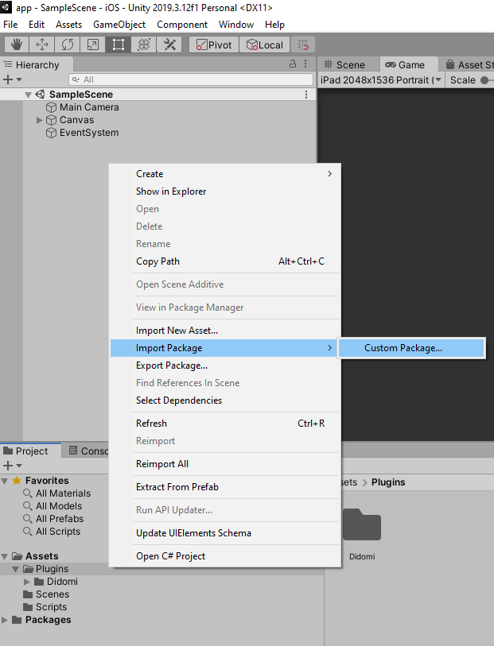
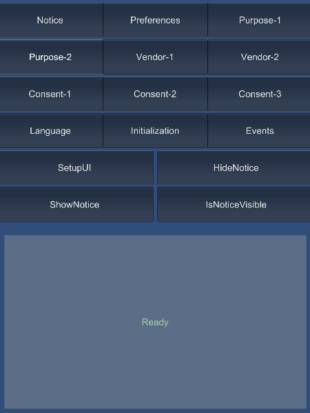

# Didomi Unity SDK Plugin Documentation

This document is intended to give details how Didomi Unity Plugin works.

# Overview

Unity has support for native plug-ins which are libraries of native code written for different platforms. There are specific folders (IOS, Android under Asset) to persist native libs on Unity projects. Also invoking the calls to native libs has specific ways for each platform.

To support Android Platform, AndroidJavaClass, AndroidJavaObject and AndroidJavaProxy classes provided by UnityEngine namespace are used. They are used to make Java calls from C#. AndroidJavaProxy is used pass C# function to be called from java via interfaces.

To support IOS platform, you need to expose your functionality in objective-c, because Unity generates projects in Objective-C. Unity doesn't have support for Swift at the moment. For that reason you need to create special objective-c++ .mm file. Unity C# dll can only invoke the functions declared in the file. 

For both IOS and Android platforms at Unity, you will also need to create a C# script which calls functions in the native library.

For Unity plugin packaging, Unity has special Unity Package to create, install and distribute plugins.


Below you can find details.

# Plugin Components

## List of importants Components
```text
Plugins/Didomi/
Plugins/Didomi/Android
Plugins/Didomi/Android/libs
Plugins/Didomi/Android/libs/android-didomi.aar
Plugins/Didomi/Editor
Plugins/Didomi/Editor/PostProcessor.cs
Plugins/Didomi/IOS
Plugins/Didomi/IOS/Didomi.framework
Plugins/Didomi/IOS/Didomi.mm
Plugins/Didomi/IOS/Newtonsoft.Json.dll
Plugins/Didomi/Scripts
Plugins/Didomi/Scripts/Android
Plugins/Didomi/Scripts/Android/AndroidDidomi.cs
Plugins/Didomi/Scripts/Android/AndroidObjectMapper.cs
Plugins/Didomi/Scripts/Android/DidomiCallableProxy.cs
Plugins/Didomi/Scripts/Android/EventListenerProxy.cs
Plugins/Didomi/Scripts/Events
Plugins/Didomi/Scripts/Events/DidomiCallable.cs
Plugins/Didomi/Scripts/Events/EventListener.cs
Plugins/Didomi/Scripts/Interfaces
Plugins/Didomi/Scripts/Interfaces/IDidomi.cs
Plugins/Didomi/Scripts/IOS
Plugins/Didomi/Scripts/IOS/DDMEventType
Plugins/Didomi/Scripts/IOS/DidomiFramework.cs
Plugins/Didomi/Scripts/IOS/IOSDidomi.cs
Plugins/Didomi/Scripts/IOS/IOSObjectMapper.cs
Plugins/Didomi/Scripts/Tests
Plugins/Didomi/Scripts/DidomiTests.cs
Plugins/Didomi/Scripts/UnityEditor
Plugins/Didomi/Scripts/UnityEditorDidomi.cs
Plugins/Didomi/Scripts/Didomi.cs
Plugins/Didomi/Scripts/Purpose.cs
Plugins/Didomi/Scripts/PurposeCategory.cs
Plugins/Didomi/Scripts/Vendor.cs
```

## Details of important Components

Unity treats special folder names like IOS and Android. At the end of the Android project generation, Unity copies Android folder to target project. At the end of the IOS XCode project generation, Unity copies IOS folder to target project. Unity also treats files by their extension. One other special folder name is Editor. Editor folders are not copied to target project. Contents of the Editor folders are for Unity Editor. It is important not to change the special folder names. It can cause to incomplete Android and IOS projects during the Unity buils.

```tex
Plugins/Didomi/
```
The root folder of the plugin.
```text
Plugins/Android/
```
The root folder  for Android related files.
```text
Plugins/Android/libs
```
The folder  Android libs are located. 
```text
Plugins/Android/libs/android-didomi.aar
```
Native Didomi-android-sdk aar file. 
```text
Plugins/Didomi/Editor
```
PostProcessor file is located in folder Editor. Unity treats "Editor" special folder name. The contents of the Editor folders are only used on Unity. The contents are not copied to target projects. So PostProcessor.cs is located under that folder.
```text
Plugins/Didomi/Editor/PostProcessor.cs
```
PostProcessor.cs contains OnPostProcessBuild function. Plugin does post processing of the generated project. You can do custom changes on the generated project. For example, you can change the contents of a file on target generated project.
```text
Plugins/Didomi/IOS
```
The root folder  for IOS related files.
```text
Plugins/Didomi/IOS/Didomi.framework
```
Native Didomi.framework contents. 
```text
Plugins/Didomi/IOS/Didomi.mm
```
The  file contains Objective-C++ code. The native functionality is provided as Objective-C++ code for external use. Unity C# dll can invoke the functions declared in the file. Each new function added to didomi sdk, must contain correspondig declaration in this file. 
```text
Plugins/Didomi/IOS/Newtonsoft.Json.dll
```
Default JSONUtility classes  in Unity  cannot serialize or deserialize datadictinary or array. So more advanced json library Newtonsoft integrated. Due to compatibility issue for illcpp, netstandard 2.0 version of the library must be used.
```text
Plugins/Didomi/Scripts
```
The root folder  for common C# files.
```text
Plugins/Didomi/Scripts/Android
```
The root folder  for common C# files related to Android platform.
```text
Plugins/Didomi/Scripts/Android/AndroidDidomi.cs
```
The implementation of IDidomi interface that is called when the app is run on Android platform. AndroidJavaClass, AndroidJavaObject and AndroidJavaProxy classes provided by UnityEngine namespace are used to make Java calls from C#.
```text
Plugins/Didomi/Scripts/Android/AndroidObjectMapper.cs
```
Main class used convert objects required by Android Plugin.
```text
Plugins/Didomi/Scripts/Android/DidomiCallableProxy.cs
```
Class used to represent an AndroidJavaProxy object for <io.didomi.sdk.functionalinterfaces.DidomiCallable> interface. With  DidomiCallableProxy we are able to give an event handler DidomiCallable to Didomi-Android-Sdk. This handler is fired when Didomi SDK is ready. AndroidJavaProxy is a special class which enables you to pass a handler to be called from Java to Unity C# methods.
```text
Plugins/Didomi/Scripts/Android/EventListenerProxy.cs
```
Class used to represent an AndroidJavaProxy object for <io.didomi.sdk.functionalinterfaces.DidomiEventListener> interface. With  EventListenerProxy we are able to give an event handler DidomiEventListener to Didomi-Android-Sdk. When new event is added to DidomiEventListener, this file must be updated.
```text
Plugins/Didomi/Scripts/Interfaces
```
The root folder  for common C# interface files.
```text
Plugins/Didomi/Scripts/Interfaces/IDidomi.cs
```
IDidomi interface defines the functionality of Unity Plugin. At the moment we have IOS, Android and UnityEditor implementations of the interface. UnityEditor which is mock implementation for the Unity platform is not complete at the moment. UnityEditor implementation is used when Didomi Plugin is run on UnityEditor. Didomi Plugin selects the implementation dynamically by checking the platform it is running.
```text
Plugins/Didomi/Scripts/IOS
```
The root folder  for common C# files related to IOS platform.
```text
Plugins/Didomi/Scripts/IOS/DDMEventType.cs
```
Event Enumeration file for Event types corresponding to didomi-ios-sdk event types.
```text
Plugins/Didomi/Scripts/IOS/DidomiFramework.cs
```
The file connects C# calls to Objective-C++.  [DllImport("__Internal")] declaration added to functions so that they are binded to Objective-C++ counterparts. Any function that will be called from Objective-C, must have correspondig declaration in this C# file.
```text
Plugins/Didomi/Scripts/IOS/IOSDidomi.cs
```
The implementation of IDidomi interface that is called when the app is run on IOS platform.
```text
Plugins/Didomi/Scripts/IOS/IOSObjectMapper.cs
```
Main class used convert objects required by IOS Plugin.
```text
Plugins/Didomi/Scripts/Tests
```
This folder contains automated tests class intended to be used at CI/CD in the future. But it is not complete. The contents in that folder can be helpful when automated tests will be created.  
```text
Plugins/Didomi/Scripts/UnityEditor
```
The root folder  for common C# files related to UnityEditor.
```text
Plugins/Didomi/Scripts/UnityEditorDidomi.cs
```
The mock implementation of IDidomi interface that is called when the app is run on Unity.
```text
Plugins/Didomi/Scripts/Didomi.cs
```
Main class exposed to apps. Users will use that class to access single instance of Didomi. Users make calls to Didomi functionality from Didomi class. Depending on the platform It is used, Didomi class directs the calls to right IDidomi implementators like IOSDidomi, AndroidDidomi or UnityEditorDidomi.
```text
Plugins/Didomi/Scripts/Purpose.cs
```
Class used to represent Purpose.
```text
Plugins/Didomi/Scripts/PurposeCategory.cs
```
Class used to represent PurposeCategory.
```text
Plugins/Didomi/Scripts/Vendor.cs
```
Class used to represent Vendor.

## Interaction of Components for Typical Scenarios

To give idea how files are related to each other, You can check below ordered interactions. They are representing generalized scenarios.


### Android Platform Interactions
For a typical native didomi-android-sdk call,following components will be used in sequential order.

-> Unity App 
-> Didomi
-> AndroidDidomi
-> (AndroidJavaClass, AndroidJavaObject and AndroidJavaProxy) 
-> Native didomi-android-sdk aar 
-> AndroidObjectMapper

### IOS Platform Interactions
For a typical native didomi-ios-sdk call, following components will be used in sequential order.

-> Unity App 
-> Didomi 
-> IOSDidomi 
-> DidomiFramework 
-> Didomi.mm 
-> Native Didomi.framework 
-> IOSObjectMapper

# PostProcessor.OnPostProcessBuild
"PostProcessor.OnPostProcessBuild" Unity allows developer to add post processing while Unity generates AndroidStudio project or IOS XCode project. You can add the class to your plugin and the method will be run after projects are created. Thanks to "PostProcessor.OnPostProcessBuild" we solve a few of issues related to using Didomi Native libs. You can view details at below links.

[Android Problems & Solutions](android_problems_and_solutions.md)
[IOS Problems & Solutions](ios_problems_and_solutions.md)

# How to release & How to Update Didomi Plugin

To be able to release a new version, libs for android and Didomi.framework must be updated.

To update native didomi-android-sdk libs,  built aar file generated at "sdk-android\android\build\outputs\aar" folder must be copied into "Assets\Plugins\Didomi\Android\libs" folder on UNITY project.

To update native didomi-ios-sdk libs, built Didomi.framework folder contents must be copied into "Assets\Plugins\Didomi\IOS\Didomi.framework" folder on UNITY project.

If the change is related to internal details of a function, there would be no change on the plugin code. You can create a Unity package for publishing. [Create Unity Package for Plugin](#-create-unity-package-for-plugin) But if a new function is added, deleted, or signature of the function has changed, then plugin code must be updated. You can check the guidelines below for how to update.

[IOS How to update](how_to_update_android.md)
[Android How to update](how_to_update_android.md)

## Create Didomi Unity Package for Unity

package.json in plugin file must be updated. Version number in package.json must be updated if it changes.


To be able to create Didomi Unity package, go to menu on UNITY as above image and click "Export Package". In the next dialog, type "Didomi" as name for package.
Didomi.unitypackage will be created at the selected location. You can publish the Didomi.unitypackage by adding the file on releases section of github repo.
 
# How to use Didomi Unity Package on Unity



To be able to install Didomi Unity package, go to menu on UNITY as above image and click "Import Package" Didomi as name for package. Didomi.unitypackage contents will be copied to Assets folder on Unity project. 

To be able set local configuration file for Didomi, you must create DidomiConfig folder under Assets folder on Unity Project. Put your didomi_config.json file in  DidomiConfig folder.

```text
Assets/DidomiConfig/didomi_config.json
```

Creating DidomiConfig is mandatory for local configuration files. Because these files must be moved to right directories when Android and IOS projects are being generated. On the post process of the unity project, Didomi Plugin moves the files in DidomiConfig to Assets folder in Android projects and to Data/Resources folder in IOS projects. For IOS Projects the configuration files will also be added to Copy Bundle Resources.


# How to Test Over Demo-Application

At the moment we don't have automated tests. So for new releases, We can use demo unity app to test functionality.



With Demo application, you can test each function call on SDK manually. Functions on the SDK are grouped. Each group has a few functions. When user touches to the group button, a few functional buttons becomes visible above the message pane. When you touch the functional button, the function is invoked. The result of the function call is displayed on the message pane. Users can also view the source code of the DemoGUI to find code scripts for how to call each function. 


# Unity Version Dependencies

We already have two cases causing dependency on specific Unity Versions. In summary we have to use Unity Version 2019.3.12f1 or later. Details are below.

## Dependency 1 Unity Version 2019.3.12f1.

Unity Version must be 2019.3.12f1.

This is caused due to bug on https://issuetracker.unity3d.com/issues/ios-swift-language-version-is-not-set-in-xcode-build-settings-when-a-swift-source-plugin-is-added-to-an-unity-project

## Dependency 1 Unity Version 2018.1

Another dependency related json serializing and deserializing. We have dependency for Unity  version 2018.1 due to that.

DefaultJsonUtiliy class doesn't convert array, set and dictionary structures, I have used NewtonSoft.dll json library. This also raised a new problem. It didn't work for ios. 
So I have used netstandard 2.0 library version of newtonsoft to not get "il2cpp not supported". It worked. But it is mentioned that this library can be used from Unity version 2018.1
on the following page https://docs.microsoft.com/en-us/dotnet/standard/net-standard. 
https://stackoverflow.com/questions/16359628/json-net-under-unity3d-for-ios


### Reference Links For Unity Plugin Development.

[https://docs.unity3d.com/Manual/Plugins.html](https://docs.unity3d.com/Manual/Plugins.html)

[https://docs.unity3d.com/Manual/PluginsForIOS.html](https://docs.unity3d.com/Manual/PluginsForIOS.html)

[https://engineering.linecorp.com/en/blog/wrapping-a-native-sdk-for-unity/](https://engineering.linecorp.com/en/blog/wrapping-a-native-sdk-for-unity/)

[https://medium.com/@kevinhuyskens/implementing-swift-in-unity-53e0b668f895/](https://medium.com/@kevinhuyskens/implementing-swift-in-unity-53e0b668f895/)

[https://stackoverflow.com/questions/31636408/write-unity-ios-plugin-in-swift-code/](https://stackoverflow.com/questions/31636408/write-unity-ios-plugin-in-swift-code/)

[https://medium.com/@SoCohesive/unity-how-to-build-a-bridge-ios-to-unity-with-swift-f23653f6261/](https://medium.com/@SoCohesive/unity-how-to-build-a-bridge-ios-to-unity-with-swift-f23653f6261/)

[https://markcastle.com/steps-to-create-a-native-android-plugin-for-unity-in-java-using-android-studio-part-1-of-2/](https://markcastle.com/steps-to-create-a-native-android-plugin-for-unity-in-java-using-android-studio-part-1-of-2/)

[https://markcastle.com/steps-to-create-a-native-android-plugin-for-unity-in-java-using-android-studio-part-2-of-2/](https://markcastle.com/steps-to-create-a-native-android-plugin-for-unity-in-java-using-android-studio-part-2-of-2/)

[https://docs.unity3d.com/Manual/AndroidUnityPlayerActivity.html/](https://docs.unity3d.com/Manual/AndroidUnityPlayerActivity.html/)

[http://www.cwgtech.com/using-android-webview-to-display-a-webpage-on-top-of-the-unity-app-view/](http://www.cwgtech.com/using-android-webview-to-display-a-webpage-on-top-of-the-unity-app-view/)

[https://www.youtube.com/watch?v=r1hLo5C50wE&feature=youtu.be/](https://www.youtube.com/watch?v=r1hLo5C50wE&feature=youtu.be/)

[https://github.com/cwgtech/AndroidWebView/blob/master/Assets/Scripts/PluginTest.cs/](https://github.com/cwgtech/AndroidWebView/blob/master/Assets/Scripts/PluginTest.cs/)

[https://github.com/cwgtech/AndroidWebView/blob/master/Assets/Scripts/RotateCube.cs/](https://github.com/cwgtech/AndroidWebView/blob/master/Assets/Scripts/RotateCube.cs/)

[https://github.com/cwgtech/AndroidWebView/blob/master/PluginProject/unity/src/main/java/com/cwgtech/unity/MyPlugin.java/](https://github.com/cwgtech/AndroidWebView/blob/master/PluginProject/unity/src/main/java/com/cwgtech/unity/MyPlugin.java/)

[https://medium.com/@rolir00li/integrating-native-ios-code-into-unity-e844a6131c21/](https://medium.com/@rolir00li/integrating-native-ios-code-into-unity-e844a6131c21/)

[https://www.mono-project.com/docs/advanced/pinvoke/](https://www.mono-project.com/docs/advanced/pinvoke/)

[https://medium.com/@rolir00li/integrating-native-ios-code-into-unity-e844a6131c21/](https://medium.com/@rolir00li/integrating-native-ios-code-into-unity-e844a6131c21/)

[https://stackoverflow.com/questions/53046670/how-to-get-values-from-methods-written-in-ios-plugin-in-unity/](https://stackoverflow.com/questions/53046670/how-to-get-values-from-methods-written-in-ios-plugin-in-unity/)

[https://docs.microsoft.com/en-us/previous-versions/visualstudio/visual-studio-2008/fzhhdwae/](https://docs.microsoft.com/en-us/previous-versions/visualstudio/visual-studio-2008/fzhhdwae(v=vs.90)/)

